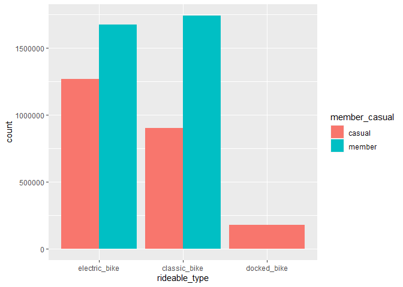
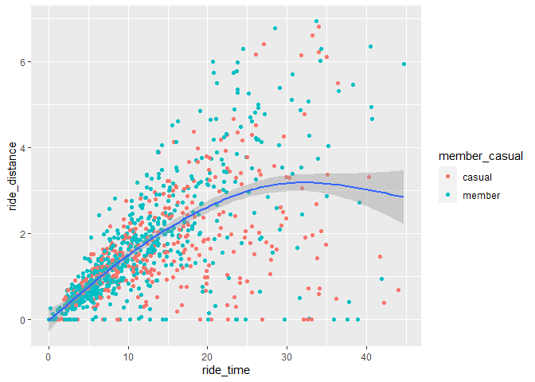
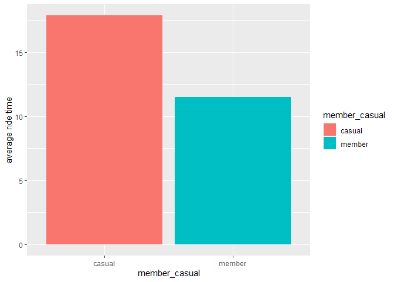
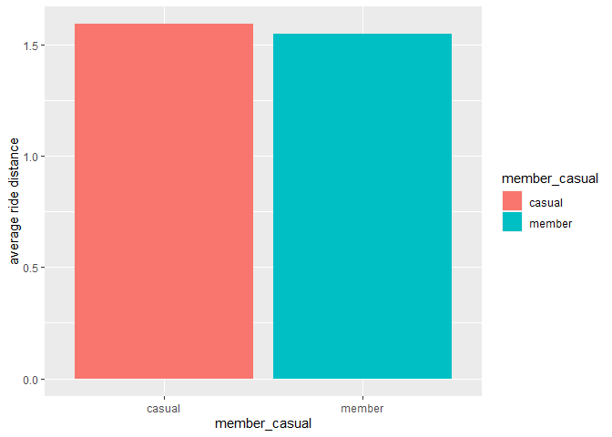
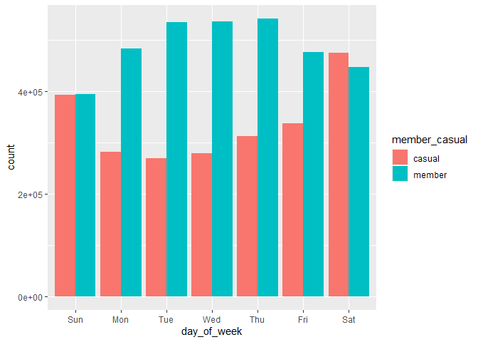
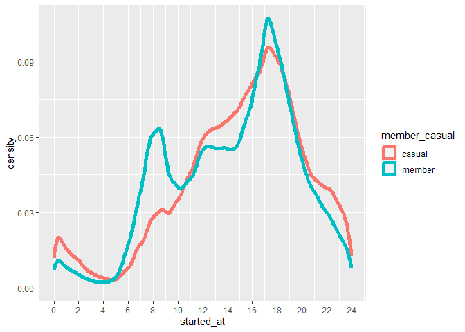
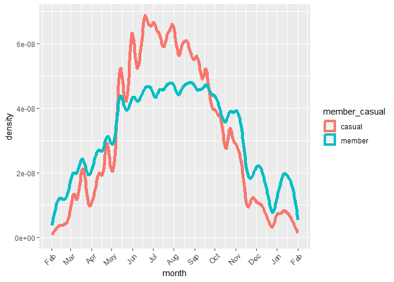
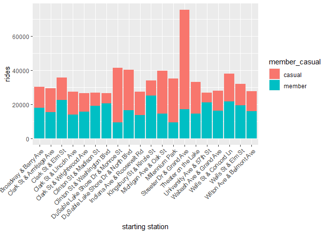

Cyclistic Bike-Share Case Study
================
Vincent Balalian

### Our Business Task: to maximize the number of annual memberships…

…(which Cyclistic’s finance analysts have concluded are much more
profitable than casual riders), by identifying actionable trends among
rider data which the marketing team can use to design new, targeted
campaigns.<br>

The director of marketing believes maximizing the number of annual
memberships is key to the company’s future success. Using the
recommendations of this analysis, the marketing team will design new
strategies for converting casual riders into annual members. To do that,
we must understand 1) how annual members and casual riders differ, 2)
why casual riders would buy a membership, and 3) how digital media could
affect our marketing tactics. <br>

Final approval of the recommended marketing program goes to the
Cyclistic executive team (which is notoriously detail-oriented). In
order to provide them with all the information they need to make their
decision, the goal of this analysis is to provide all of the relevant
insights in a way that’s easy to digest without sacrificing
attention-to-detail.

### Data Sources

The “Cyclistic” dataset was provided by Google as part of their Coursera
Data Analytics course Capstone project, though the data itself has been
made available by Motivate International Inc. under this
[license](https://www.divvybikes.com/data-license-agreement). <br><br>
Despite the fictional nature of the titular company, the data itself
reflects the operations of an actual, high-volume bike-share business,
which gives us a substantial amount of comprehensive, real-world data to
work with. (Any personal or private information has already been
removed.) <br><br> The data itself can be found
[here](https://divvy-tripdata.s3.amazonaws.com/index.html), where csv
files are available for each month/period of data, dating back to 2013.
For the purposes of this analysis, we’ll be using the data from February
2022 to January 2023.

#### Environment Setup

``` r
library(tidyverse)
library(skimr)
library(lubridate)
```

#### Data Import

``` r
setwd("original data")
df <- list.files() %>% 
  read_csv(id="file_name")
```

#### Data Preview

``` r
skim_without_charts(df)
```

|                                                  |         |
|:-------------------------------------------------|:--------|
| Name                                             | df      |
| Number of rows                                   | 5754248 |
| Number of columns                                | 14      |
| \_\_\_\_\_\_\_\_\_\_\_\_\_\_\_\_\_\_\_\_\_\_\_   |         |
| Column type frequency:                           |         |
| character                                        | 8       |
| numeric                                          | 4       |
| POSIXct                                          | 2       |
| \_\_\_\_\_\_\_\_\_\_\_\_\_\_\_\_\_\_\_\_\_\_\_\_ |         |
| Group variables                                  | None    |

Data summary

**Variable type: character**

| skim_variable      | n_missing | complete_rate | min | max | empty | n_unique | whitespace |
|:-------------------|----------:|--------------:|----:|----:|------:|---------:|-----------:|
| file_name          |         0 |          1.00 |  25 |  31 |     0 |       12 |          0 |
| ride_id            |         0 |          1.00 |  16 |  16 |     0 |  5754248 |          0 |
| rideable_type      |         0 |          1.00 |  11 |  13 |     0 |        3 |          0 |
| start_station_name |    843525 |          0.85 |   7 |  64 |     0 |     1679 |          0 |
| start_station_id   |    843525 |          0.85 |   3 |  37 |     0 |     1311 |          0 |
| end_station_name   |    902655 |          0.84 |   9 |  64 |     0 |     1696 |          0 |
| end_station_id     |    902655 |          0.84 |   3 |  37 |     0 |     1316 |          0 |
| member_casual      |         0 |          1.00 |   6 |   6 |     0 |        2 |          0 |

**Variable type: numeric**

| skim_variable | n_missing | complete_rate |   mean |   sd |     p0 |    p25 |    p50 |    p75 |   p100 |
|:--------------|----------:|--------------:|-------:|-----:|-------:|-------:|-------:|-------:|-------:|
| start_lat     |         0 |             1 |  41.90 | 0.05 |  41.64 |  41.88 |  41.90 |  41.93 |  42.07 |
| start_lng     |         0 |             1 | -87.65 | 0.03 | -87.84 | -87.66 | -87.64 | -87.63 | -87.52 |
| end_lat       |      5899 |             1 |  41.90 | 0.07 |   0.00 |  41.88 |  41.90 |  41.93 |  42.37 |
| end_lng       |      5899 |             1 | -87.65 | 0.11 | -88.14 | -87.66 | -87.64 | -87.63 |   0.00 |

**Variable type: POSIXct**

| skim_variable | n_missing | complete_rate | min                 | max                 | median              | n_unique |
|:--------------|----------:|--------------:|:--------------------|:--------------------|:--------------------|---------:|
| started_at    |         0 |             1 | 2022-02-01 00:03:18 | 2023-01-31 23:56:09 | 2022-07-27 22:50:40 |  4824419 |
| ended_at      |         0 |             1 | 2022-02-01 00:09:37 | 2023-02-04 04:27:03 | 2022-07-27 23:09:33 |  4837610 |

A precursory glance tells us: <br>1) all 12 months of data were
successfully imported into a single dataframe, and <br>2) aside from a
few variables (start and end stations, and end coordinates), the data is
complete.

``` r
head(df)
```

    ## # A tibble: 6 × 14
    ##   file_name      ride_id ridea…¹ started_at          ended_at            start…²
    ##   <chr>          <chr>   <chr>   <dttm>              <dttm>              <chr>  
    ## 1 202202-divvy-… E1E065… classi… 2022-02-19 18:08:41 2022-02-19 18:23:56 State …
    ## 2 202202-divvy-… 1602DC… classi… 2022-02-20 17:41:30 2022-02-20 17:45:56 Halste…
    ## 3 202202-divvy-… BE7DD2… classi… 2022-02-25 18:55:56 2022-02-25 19:09:34 State …
    ## 4 202202-divvy-… A1789B… classi… 2022-02-14 11:57:03 2022-02-14 12:04:00 Southp…
    ## 5 202202-divvy-… 07DE78… classi… 2022-02-16 05:36:06 2022-02-16 05:39:00 State …
    ## 6 202202-divvy-… 9A2F20… classi… 2022-02-07 09:51:57 2022-02-07 10:07:53 St. Cl…
    ## # … with 8 more variables: start_station_id <chr>, end_station_name <chr>,
    ## #   end_station_id <chr>, start_lat <dbl>, start_lng <dbl>, end_lat <dbl>,
    ## #   end_lng <dbl>, member_casual <chr>, and abbreviated variable names
    ## #   ¹​rideable_type, ²​start_station_name

#### Using this data…

…we can identify trends among casual riders and annual members by
looking at *what* they ride (rideable_type), *when* they ride
(started_at, ended_at), and *where* they ride (starting and ending
locations). We can also expand on the given “start” and “end” data to
determine *how long* they ride, and *how far*.

### Data Processing

The dataset is very long (over 5 million rows), but not too wide. Since
the scope of this analysis is relatively simple, processing, analysis,
and visualization of the data will be done in **R Studio**, which is
uniquely suited to the current business task.

Since there’s not much cleaning needed to work with this dataset, let’s
continue transforming the original dataframe into different forms that
will be useful for later analysis and visualization. <br><br> First,
let’s see if we can get an accurate conversion of distance. <br><br>
According to usgs.gov, distance between latitudes is fairly constant,
but distance between longitudes varies depending on the latitude. Let’s
take a look at the latitudes of each ride and see if there’s much
variation.

``` r
ggplot(data=df, mapping=aes(x=start_lat)) +
  geom_histogram()
```

<!-- -->
<br> Since the distribution of latitudes is so visibly narrow, we can
assume that our distance conversions will be accurate enough for the
purposes of this analysis. Therefore, let’s create a new variable,
ride_distance, in miles.

#### Transforming Data

The following chunk creates a new dataframe, df2, which also calculates
values for ride_time (in minutes) based on the available location data.

``` r
df2 <- df %>% 
  mutate(ride_time=as.numeric(abs(ended_at-started_at))/60,
         lat_diff=round(abs(start_lat-end_lat)*69, digits=6), 
         lng_diff=round(abs(start_lng-end_lng)*52, digits=6),
         ride_distance=round(abs(lat_diff+lng_diff), digits=6),
         day_of_week=wday(df$started_at, label=TRUE)
         ) %>%
  select(-file_name, -ride_id, -end_lat, -end_lng, -lat_diff, 
           -lng_diff)
# reorder for a more favorable view
df2 <- df2[,c(1, 10, 11, 12, 13, 2, 3, 5, 7, 4, 6, 8, 9)]
head(df2)
```

    ## # A tibble: 6 × 13
    ##   rideable_type member_casual ride_time ride_dista…¹ day_o…² started_at         
    ##   <chr>         <chr>             <dbl>        <dbl> <ord>   <dttm>             
    ## 1 classic_bike  member            15.2         2.50  Sat     2022-02-19 18:08:41
    ## 2 classic_bike  member             4.43        0.797 Sun     2022-02-20 17:41:30
    ## 3 classic_bike  member            13.6         0.998 Fri     2022-02-25 18:55:56
    ## 4 classic_bike  member             6.95        1.05  Mon     2022-02-14 11:57:03
    ## 5 classic_bike  member             2.9         0.483 Wed     2022-02-16 05:36:06
    ## 6 classic_bike  member            15.9         1.61  Mon     2022-02-07 09:51:57
    ## # … with 7 more variables: ended_at <dttm>, start_station_id <chr>,
    ## #   end_station_id <chr>, start_station_name <chr>, end_station_name <chr>,
    ## #   start_lat <dbl>, start_lng <dbl>, and abbreviated variable names
    ## #   ¹​ride_distance, ²​day_of_week

Let’s check for outliers among ride_time and ride_distance.

``` r
df2 %>% 
  select(ride_time, ride_distance) %>% 
  skim()
```

|                                                  |            |
|:-------------------------------------------------|:-----------|
| Name                                             | Piped data |
| Number of rows                                   | 5754248    |
| Number of columns                                | 2          |
| \_\_\_\_\_\_\_\_\_\_\_\_\_\_\_\_\_\_\_\_\_\_\_   |            |
| Column type frequency:                           |            |
| numeric                                          | 2          |
| \_\_\_\_\_\_\_\_\_\_\_\_\_\_\_\_\_\_\_\_\_\_\_\_ |            |
| Group variables                                  | None       |

Data summary

**Variable type: numeric**

| skim_variable | n_missing | complete_rate |  mean |     sd |  p0 |  p25 |   p50 |   p75 |     p100 | hist  |
|:--------------|----------:|--------------:|------:|-------:|----:|-----:|------:|------:|---------:|:------|
| ride_time     |         0 |             1 | 19.31 | 175.33 |   0 | 5.77 | 10.20 | 18.33 | 41387.25 | ▇▁▁▁▁ |
| ride_distance |      5899 |             1 |  1.66 |   8.91 |   0 | 0.67 |  1.21 |  2.16 |  7448.03 | ▇▁▁▁▁ |

It looks like both variables have some outliers which should be removed
for the purposes of this analysis.

``` r
probabilities <- c(0.01, 0.50, 0.90, 0.95, 0.99, 0.999, 0.9999)
round(quantile(df2$ride_time, probs=probabilities))
```

    ##     1%    50%    90%    95%    99%  99.9% 99.99% 
    ##      0     10     32     45    106   1234   8748

``` r
round(quantile(df2$ride_distance, probs=probabilities, na.rm=TRUE)) 
```

    ##     1%    50%    90%    95%    99%  99.9% 99.99% 
    ##      0      1      4      5      7     11     15

While the outliers in ride_distance seem restricted to only a few
values, the outliers in ride_time are a bit harder to pinpoint. Looking
at the percentiles listed above, it’s clear ride_time values start to
spike above the 99th percentile. Since the purpose of this analysis is
to help target the largest group of potential member converts, when we
explore ride times and distances, we’ll ignore obvious outliers.

### Exploratory Analysis

First, let’s take a look at the distributions of the two primary
categorical values: **rideable_type**, and **member_casual**.

``` r
count(df, rideable_type, member_casual) %>%
  arrange(desc(n))
```

    ## # A tibble: 5 × 3
    ##   rideable_type member_casual       n
    ##   <chr>         <chr>           <int>
    ## 1 classic_bike  member        1738047
    ## 2 electric_bike member        1672681
    ## 3 electric_bike casual        1266875
    ## 4 classic_bike  casual         898394
    ## 5 docked_bike   casual         178251

``` r
ggplot(data=df, mapping=aes(x=fct_infreq(rideable_type), fill=member_casual)) + 
  geom_bar(position="dodge") +
  labs(x="rideable_type")
```

<!-- -->
<br> One thing immediately stands out: while annual members are only
*somewhat* more likely to ride classic bikes over electric bikes, a
noticeable majority of casual riders use *electric bikes* over classic
bikes. Also, 100% of the 178251 docked bike rides were made by casual
riders. <br><br> Let’s see how rides break down by time and distance:

``` r
df2 %>% 
  filter(ride_time < 45, ride_distance < 7) %>%
  sample_n(1000) %>% 
  ggplot(aes(x=ride_time, y=ride_distance)) +
  geom_point(aes(color=member_casual)) +
  geom_smooth()
```

<!-- -->
<br> Members and casual riders appear to ride for similar times and
distances. Let’s see if that holds true.

``` r
time_and_distance_averages <- df2 %>% 
  filter(ride_time < 106, ride_distance < 7) %>%
  group_by(member_casual) %>% 
  summarize(mean_rt=mean(ride_time), mean_rd=mean(ride_distance),)
time_and_distance_averages %>% 
  ggplot(aes(x=member_casual, y=mean_rt, fill=member_casual)) +
  labs(y="average ride time") +
  geom_col()
```

<!-- -->

``` r
time_and_distance_averages %>% 
  ggplot(aes(x=member_casual, y=mean_rd, fill=member_casual)) +
  labs(y="average ride distance") +
  geom_col()
```

<!-- -->
<br> Surprisingly, the average casual rider appears to ride for
significantly more time than their member counterparts (with little
difference between average ride distances). <br><br> Let’s see how the
rides break down by day_of_week.

``` r
ggplot(df2, aes(x=day_of_week, fill=member_casual)) +
  geom_bar(position="dodge")
```

<!-- -->
<br> Right away, it’s clear annual members are far more likely to ride
during weekdays, while casual riders ride more often on weekends.
<br><br> Let’s see how rides break down by time of day.

``` r
df2 %>% 
  mutate(started_at=(hour(started_at) + minute(started_at)/60)) %>% 
  ggplot(aes(x=started_at, color=member_casual)) +
  geom_density(linewidth=2) +
  scale_x_continuous(breaks=seq(from=0, to=24, by=2))
```

<!-- -->
<br> Usage by both members and casual riders tends to ramp up throughout
the day, with both dropping off significantly after peaking around 6 pm.
Annual members see significant usage spikes corresponding with normal
commuting hours, while casual riders’ usage is conspicuously low during
morning commute hours. <br><br> Now, let’s break down rides by month:

``` r
ggplot(df2, aes(x=started_at, color=member_casual)) +
  geom_density(linewidth=2) +
  scale_x_datetime(date_breaks = "month", date_labels = "%b") +
  theme(axis.text.x=element_text(angle=45, hjust=1)) +
  labs(x="month")
```

<!-- -->
<br> Among all riders, usage peaks during summer and craters in winter;
but the difference is more pronounced among casual riders, with usage
heavily concentrated among late spring and summer. <br><br> Now let’s
check out our top (starting) stations overall:

``` r
top_stations_overall <- df2 %>%
  count(start_station_name, sort=T, name="rides") %>%
  drop_na() %>% 
  head(20)
top_stations_overall
```

    ## # A tibble: 20 × 2
    ##    start_station_name                 rides
    ##    <chr>                              <int>
    ##  1 Streeter Dr & Grand Ave            75506
    ##  2 DuSable Lake Shore Dr & Monroe St  41404
    ##  3 DuSable Lake Shore Dr & North Blvd 40190
    ##  4 Michigan Ave & Oak St              39833
    ##  5 Wells St & Concord Ln              37938
    ##  6 Clark St & Elm St                  35633
    ##  7 Millennium Park                    35211
    ##  8 Kingsbury St & Kinzie St           34151
    ##  9 Theater on the Lake                33038
    ## 10 Wells St & Elm St                  31954
    ## 11 Broadway & Barry Ave               30205
    ## 12 Clark St & Armitage Ave            29360
    ## 13 Wabash Ave & Grand Ave             28023
    ## 14 Wilton Ave & Belmont Ave           27739
    ## 15 Indiana Ave & Roosevelt Rd         27528
    ## 16 Clark St & Lincoln Ave             27484
    ## 17 University Ave & 57th St           26933
    ## 18 Clinton St & Madison St            26763
    ## 19 Clinton St & Washington Blvd       26651
    ## 20 Clark St & Wrightwood Ave          26511

``` r
top_stations_overall_count <- df2 %>% 
  filter(start_station_name %in% top_stations_overall$start_station_name) %>% 
  count(start_station_name, member_casual, sort=T, name="rides")
```

``` r
top_stations_overall_count %>% 
  ggplot(aes(x=start_station_name, y=rides, fill=member_casual)) +
  geom_col() +
  theme(axis.text.x=element_text(angle=45, hjust=1)) +
  labs(x="starting station")
```

<!-- -->
<br> The “Streeter Dr & Grand Ave” station, which is the top starting
station among all riders, is disproportionately favored by casual
riders. Other popular stations also skew strongly in favor of casual
riders, including “DuSable Lake Shore Dr & Monroe St,” “Millenium Park,”
“Michigan Ave & Oak St,” and “DuSable Lake Shore Dr & North Blvd.”

### Recap

Based on this analysis, we’ve learned a few things about casual riders
and how their tendencies differ from those of current members.

#### On average, Casual Riders:

- **Prefer electric bikes** (Annual members prefer classic bikes.)

- **Ride for longer time periods** (with little difference between ride
  distances).

- **Ride more often on weekends** (as opposed to members, who ride more
  during the week). <br><br> The trends above have a “leisurely” aspect
  to them which suggests casual riders tend to use Cyclistic products
  recreationally, while annual members are more likely to use them for
  work or school transportation.

#### Also:

- **Usage by both members and casual riders tends to ramp up throughout
  the day**, and drop off significantly after **peaking around 6 pm**;
  but while member usage spikes during both morning and evening
  commuting hours, **usage by casual riders is conspicuously low in the
  morning**. <br> This could mean several things. Casual riders may be
  less likely to work full-time jobs. Perhaps a higher share of casual
  riders are college students. It’s also likely that many casual riders
  are tourists or, as we’ve seen, “weekend warriors.”

- Among all riders, **usage peaks during summer and craters in winter**;
  but **the difference is more pronounced among casual riders**, with
  usage heavily concentrated among summer months.

- **Some stations** (like the “Streeter Dr & Grand Ave” station) **are
  disproportionately favored by casual riders.** <br> (Other popular
  stations that skew strongly in favor of casual riders include “DuSable
  Lake Shore Dr & Monroe St,” “DuSable Lake Shore Dr & North Blvd,”
  “Millenium Park,” and “Michigan Ave & Oak St.”)

### Recommendations

In order to achieve our goal of maximizing the number of annual
memberships by converting casual riders, I suggest the marketing
department incorporate the following into their plans:

#### 1) Concentrate marketing efforts on the more popular time periods among casual riders…

…such as afternoons and **evenings**, during **weekends**, during the
months of **May through September**.

#### 2) Conduct in-person marketing campaigns at select stations…

…which, having higher ratios of casual riders, present an opportunity to
efficiently target them where they’re most likely to be.

#### 3) Highlight electric bikes, and their range/capacity

We know that, unlike current members, casual riders prefer electric
bikes over classic bikes. We also know casual riders ride for
substantially longer times. An effective marketing campaign should
highlight these two features. <br><br> Overall, there are clear
differences among trends between casual riders and established members,
and clear opportunities to target them using these insights. <br><br>
